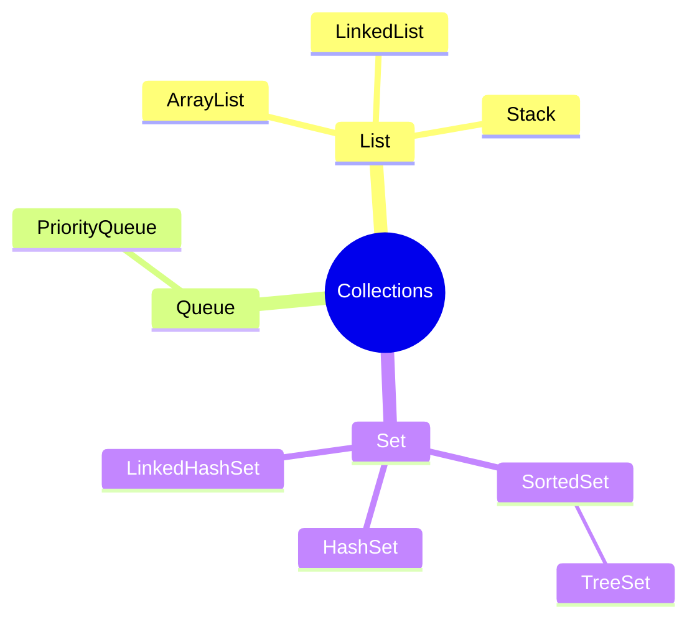

# Nível Intermediário
## Classes e Objetos
As classes são moldes que criamos, definindo variáveis de instância(atributos) e métodos. Com esses moldes criados podemos criar os objetos. Os objetos podem inserir valores nos atributos da classe e usar os métodos delas.
<hr>

## Métodos e Parâmetros
Os métodos definem os comportamentos de uma classe (e consequentemente dos objetos criados por essa classe). Os métodos podem ter ou não ter um retorno. Além de receber, ou não, argumentos (parâmetros) no seu escopo.
<hr>

## Orientação a Objetos
É uma forma de organizar a aplicação pensando em objetos. Para isso, temos 4 pilares fundamentais da POO.
- Herança
- Polimorfismo
- Encapsulamento
- Abstração
<hr>

## Herança
Permite que classes filhas, sejam criadas a partir de uma classe pai e herdem os atributos e métodos dessa classe. Além de poderem criar outros atributos e outros métodos.
<hr>

## Herança Múltipla
Uma classe pode extender os métodos e atributos de apenas uma classe. Mas, pode implementar infinitas interfaces. Podendo assim, herdar métodos de múltiplas interfaces.
<hr>

## Interfaces
Uma interface define um contrato (definindo assinaturas de métodos) que qualquer classe que implementar a interface deverá cumprir.
Por padrão, todos os atributos de uma interface são `final` e **devem** ser inicializados.
<hr>

## Polimorfismo
No polimorfismo, os métodos herdados ou implementados podem assumir comportamentos diferentes dependendo da classe que o implementar.
<hr>

## Construtores
Os construtures padronizam a forma como um objeto é criado e inicializado.
- No args constructor
- All args constructor
<hr>

## Abstração
- Classes abstratas não podem ser instânciadas, evitando objetos serem criados a partir de uma classe pai.
- Métodos podem ser definidos como abstratos. Para isso, eles não podem ter um corpo. O corpo do método será definido em cada uma das classes filhas.
<hr>

## Classes Abstratas x Interfaces
É impossível criar objetos em classes abstratas e em interfaces. 
Objetos só podem ser criados a partir de classes comuns.
Uma classe abstrata obriga que quaiquer objetos sejam criados a partir das subclasses.
Classes abstratas são indispensáveis para escalabilidade e manutenção do código.
Toda vez que um método é criado em uma Interface, eles são abstratos.
Atributos criados em interfaces são automáticamente _final_. Ou seja, são constantes, seus valores não podem ser alterados depois de sua criação.
<hr>

## Super e Sub classes
Uma sub classe herda tudo da sua super classe, exceto, os métodos construtores. 
Para uma sub classes "herdar" um construtor, ela precisa instanciar este construtor dentro da sua classe, usar a palavra `super` ao invés de `this` para indicar que os atributos que serão inicializados pelos construtores são os da super classe.
<hr>

## Sobrecarga de Construtores
Os construtores são imutáveis. Caso precisemos refatorar uma classe, refatorar os atributos dela, não podemos refatorar o atual cosntrutor dessa classe. Precisamo criar um novo. Mas, não precisamos atribuir valores a todos os atributos novamente, apenas os novos. Os antigos podem ser reatribuidos pela palavra reservada `super`.
<br>Exemplo:

```java
public construtorAntigo(String nome){
    this.nome = nome;
}

public construtorNovo(String nome, int idade){
    super(nome);
    this.idade = idade;
}
```
<hr>

## Sobrecarga de métodos
Permite criar métodos com o mesmo nome, porém, com argumentos diferentes...
```java
package interfaces;

void listarUsuarios();
void listarUsuarios(String nome);
void listarUsuarios(String email);
void listarUsarios(int id);
```
<hr>

## @Override - Sobrescrita de Métodos
Os métodos **NÃO** precisão ser sobrescritos. Usamos a notação override pelos padrões da convenção Java.
Isso é um padrão e uma das boas práticas do desenvolvimento java. 
Além disso, a notação override ajuda a evitar sobrescrever errôneamente métodos, ao errar um caracter do método ou coisas do tipo.
<hr>

## Referência de memória e Valor em memória
Instâncias de objetos não armazenam o objeto em si, mas, armazenam uma referência ao local da memória onde se encontra o objeto.
Já, os atributos do objetos, quando acessados a partir do objeto, retornam um valor em memória.<br>
Exemplo:

```java
import NivelIntermediario.Personagem;

Personagem p = new Personagem();
System.out.print(p);    // retorna o espaço da memória em que o objeto está armazenado
System.out.print(p.nome); // retorna o valor de nome alocado na memória
```
<hr>

## toString
Método que deve ser sobrescrito em todas as classes para mostrar em forma de String os valores alocados na memória e não os valores de referência alocados!
<hr>

## final
Métodos e atributos marcados com `final` não podem **NUNCA** serem sobrescritos e alterados.
A marcação torna um método ou atributo numa constante, algo imutável.
Uma classe marcada com `final` não pode se tornar uma superclasse.
<hr>

## Enums
Deve ser usado sempre que se deseja padronizar o código. **Mas** é necessário ter certeza de que os valores nunca mudarão.
Arquivo para armazenar valores que nunca podem mudar. Um armazenamento de constantes.
Um enum pode ter atributos. Caso tenha atributos, ele precisa ter o construtor dentro de si e criar os enums.

## Encapsulamento
Uso da palavra reservada `private` para proteger os atribudos das classes de atribuições de valores.
Obriga uma padronização das atribuições de valores aos atributos de classe. 
Para inserir valores, usamos o prefixo _set_ e para buscar os valores _get_.
### Quais problemas o encapsulamento resolve?
- Segurança
  - Garante que o código não tenha vazamentos nem alterações inesperadas
- Code review
  - Facilita a leitura e revisão do código
  - Os _getters_ e _setters_ tornam a leitura do código mais lógica
- Padronização
  - Força todas as pessoas a usarem os _gets e sets_

## Arrays e Listas
Um array é um objeto de memória, ou seja, eu referencio espaços de memória dentro do array. 
Além disso, os arrays são estáticos. Após se definir o tamanho dele, não é possível alterar.
Diferente das listas. Que podem ter seus tamanhos aumentados
Métodos para manusear uma Lista:
```java
// cria a lista
List<tipo-da-lista> nomeLista = new Lista<tipo-da-lista>();

// adiciona elementos
nomeLista.add("Nome do elemento");
nomeLista.add(2, "Nome do elemento");

// remove elementos
nomeLista.remove("nome do elemento");

// altera um elemento
// set(index elemento, conteúdo novo elemento)
nomeLista.set(0, "novo nome elemento");

// ver tamanho da lista
nomeLista.size();
```
### Array List
As listas são ordenadas por indexes
Nas listas, quando há necessidade de se adicionar um novo elemento, elas inserem o novo elemento no final da lista.
Mas, caso queiramos adicionar o elemento em outra posição do array, podemos. Porém, precisaremos abrir um espaço na lista,
adicionar o novo elemento e reordenar todos os outros elementos da lista.
As listas são extremamente antiperformaticas para remover, adicionar ou mover um elemento da lista.
**Os arrays list são ótimos quando se quer procurar um elemento, pois ele é ordenado por index.
Mas, quando se quer fazer inúmeras operações ele não é a melhor opção. Por que o algoritmo
não fica performático**

### Linked List 
**São terríveis para procurar um elemento, mas, para adicionar elementos e realizar outras operações são muito performáticas.**
Nas linked list, cada elemento da lista guarda o seu valor e armazena um ponteiro que indica onde está o próximo elemento.
Dessa forma, para adicionar um novo elemento, basta ajustar o ponteiro do elemento anterior
e o elemento inserido basta a apontar para o próximo elemento.
Nas linked list, não necessariamente são listas com endereços de memória sequênciais.
As Linked Lists tem esses nomes pois um elemento está linkado no próximo elemento.

## Generics 
Deixa o código mais escalável.
Facilita manutenção.
Torna o código mais reutilizável.

Ao usar Generics, devemos definir na criação da uma classe, que essa classe recebe **quaisquer tipos**.
`public class Classe<T>{}`
O uso da letra `T` é o caso mais comum para mostra que uma classe é genérica.
As classes genéricas, armazenam conteúdos de diversas classes. Sendo assim, nos seus atributos, devemos inserir uma lista para armazenar esses conteúdos.
`private List<T> lista = new ArrayList<>()`

## Records
São um tipo de "classe", onde, todos os atributos são criados, porém, são do tipo `final`.
Ao criar um record, definimos os seus atributos e automaticamente já são definidos os: gets, sets, construtores e outros métodos Java.
Além disso, os records também pode ter métodos escritos no seu escopo.

## Stack (pilha)
Se assemelha a uma lista, porém, devemos olhar para esse lista de forma vertical. 
Onde o último elemento a entrar é o primeiro a sair. (FILO)
As pilhas possuem 4 métodos:
- `push` - adiciona elementos na pilha
- `pop` - retira elementos da pilha
- `peek` - mostra o próximo elemento da pilha
- `size` - mostra o tamanho da pilha

## Queue (filas)
SE assemelha a uma lista, porém, o primeiro elemento a entrar é o primeiro a sair
FIFO - First in first out
Trabalha com HEAD e TAIL (cabeça e rabo). O primeiro elemento é a cabeça e o último o rabo.
Uma queue é inicializada da seguinte maneira: `Queue<String> queue = new LinkedList<>();`
As filas são versões simplificadas das listas encadeadas.
As filas não permitem deletar o TAIL, nem o meio, nem ninguém. Só é possível remover o primeiro elemento
Métodos para manusear as filas: 
- `add()` - adicionar elementos
- `peek()`- ver o próximo elemento
- `pool()` - remove o primeiro elemento
- `isEmpty()` - verifica se a fila está vazia

## Collections
É uma interface implementada pelas interfaces e/ou classes de estruturas de dados
As colections são uma _interface_ usada nas estruturas de dados como: ArraysList, NivelIntermediario.Collection.List.LinkedList, Queues...


## Set
### HashSet
É usado no lugar de uma lista quando queremos ignorar elementos duplicados dentro da estrutura de dados.
O Set **não trabalha com ordenação**. A ordem é aleatória.

### TreeSet
Assim como o `HashSet<>`, impede a inserção duplicados, **mas,** os `TreeSet<>` ordenam os elementos automáticamente em ordem alfabética.

### LinkedHashSet
Não repete elementos, não há ordenação, mas, a ordem de implementação é a ordem de implementação.

## Big O
Mostra como o algoritmo escala em função do tamanho do input.
Big O olha para a escalabilidade dos algoritmos. Não o quanto de memória utilizamos.
### Complexidade temporal
Diz respeito a quanto tempo se demora para construir o algoritmo
### Complexidade espacial
Diz respeito à quanto de memória usamos para construir o algoritmo.
### Big O notations
- O(1) constante
  - Independente do tamanho do input, o tempo de execução é o mesmo
  - Ex: pegar o primeiro elemento de um Array
- O (Log N)
  - Conforme o input aumenta em n, o tempo de execução aumenta em log n
  - Conforme o input aumenta exponencialmente, o tempo de execuçõa aumenta linearmente.
- O (N Log N)
  - Sorting
  - Didive and Conquer
    - 

## Tipo Estático x Tipo dinâmico
As linguagens de tipo estático sempre mostrarão um erro no tempo de COMPILAÇÃO do código. 
Ou seja, nem é permitido rodar o código para identificar o erro. A aplicação não roda enquanto o erro estiver no código.

As linguagens de tipo dinâmico mostram os erros apenas ao iniciar a aplicação.
Ou seja, os erros são exibidos em tempo de execução.

## Linguagens de tipo forte
As linguagens de tipo forte, tipagem forte, não permitem que o tipo de uma variável seja alterada!
